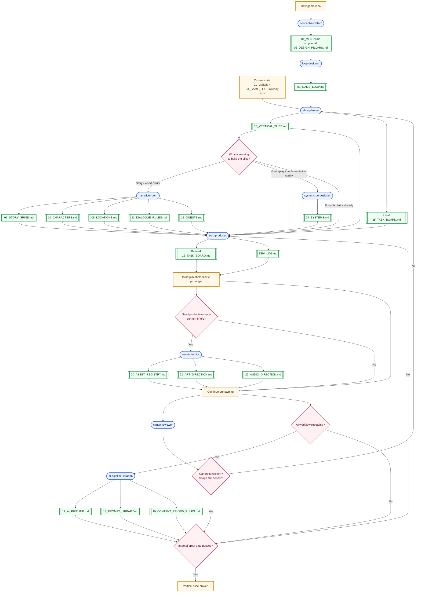

# Game Stack Skill Architecture Handoff

This document is a handoff for continuing the skill-design work in:

`/Users/calvinku/FunProjects/game-stack`

It captures the current recommendation for how to evolve `game-stack` from a small set of doc-creation skills into a more general AI-assisted solo game-dev workflow.

## Goal

Turn `game-stack` into a reusable skill system for solo developers making games with AI, while preserving the core methodology already defined in:

- `docs/GAME_PROJECT_SYSTEM.md`
- `docs/GAME_PROJECT_FULL_SYSTEM.md`
- `docs/GAME_PROJECT_TEMPLATES.md`
- `docs/GAME_PROJECT_SOLO_PRACTICAL_MODE.md`
- `docs/GAME_PROJECT_SKILL_CREATION.md`

The key design shift is:

- do not think only in terms of `one skill = one doc`
- think in terms of `one skill = one leverage point in the workflow`
- let canonical docs be outputs of those workflow skills

This still allows doc-oriented entrypoints such as `/create-vision` or `/create-vertical-slice`, but the underlying skill logic should be job-based rather than file-based.

## High-Level Decision

Use a hybrid model:

### User-facing UX

Keep simple commands that feel doc- and task-oriented.

Examples:

- `/create-vision`
- `/create-game-loop`
- `/create-vertical-slice`
- `/define-system`
- `/plan-week`
- `/review-canon`

### Underlying skill model

The actual skills should be workflow operators that clarify, convert, or review.

Examples:

- `concept-architect`
- `loop-designer`
- `slice-planner`
- `systems-co-designer`
- `solo-producer`
- `canon-reviewer`

### Why this is better

Because the real bottlenecks are not single docs.

Examples:

- a vertical slice requires vision + loop + scope cuts + system list + task plan
- a weekly plan requires slice scope + current blockers + available time
- a system spec requires loop intent + engine constraints + tests

If the skills are doc-only, they risk becoming thin markdown generators.
If the skills are workflow-based, they can make stronger decisions and still write directly into the canonical docs.

## Core Principles To Preserve

These should remain true across all skill design:

1. One canonical source per topic.
2. Finish a vertical slice before expanding the full game.
3. Internal proof gate comes before external showcase gate.
4. Skills should clarify, convert, or review.
5. Skills should read the minimum relevant canon before acting.
6. Skills should produce outputs that can be merged directly into canonical docs.
7. Skills should avoid creating parallel project memory in chat.
8. Skills should challenge vagueness and expose fake scope.

## Recommended Skill Set

Split the skills into:

- Core workflow skills
- Supporting content skills
- Review and process skills

### Core workflow skills

1. `concept-architect`
2. `loop-designer`
3. `slice-planner`
4. `systems-co-designer`
5. `solo-producer`
6. `canon-reviewer`

### Supporting content skills

7. `narrative-room`
8. `asset-director`

### Review and process skills

9. `ai-pipeline-librarian`

## Skill Specs

Below is the recommended first-pass definition for each skill.

---

## 1. concept-architect

### Job

Turn a rough game idea into a clear concept, scope boundary, and first vertical-slice hypothesis.

### When to use

- brand-new project
- confused early-stage concept
- concept drift
- vague premise that needs compression

### Reads from canon

- `docs/01_vision/01_VISION.md` if it exists
- `docs/01_vision/02_DESIGN_PILLARS.md` if it exists

### Inputs

- raw premise
- inspirations and references
- emotional tone
- intended platform or format
- solo-dev constraints
- time budget or ambition level

### Outputs

- one-sentence concept
- player fantasy
- design pillars
- MVP proof statement
- non-goals
- candidate vertical slice concepts

### Writes or updates

- `docs/01_vision/01_VISION.md`
- optionally `docs/01_vision/02_DESIGN_PILLARS.md`

### Boundaries

- does not define implementation details
- does not create full story/world canon
- does not plan the whole production roadmap

### Interaction style

- compress
- challenge vagueness
- force tradeoffs
- ask what must be proved, not what would be nice someday

### Good entrypoints

- `/create-vision`
- `/refine-concept`

---

## 2. loop-designer

### Job

Define the player-facing gameplay rhythm: what the player does, how the game responds, and why the loop keeps pulling forward.

### When to use

- after concept clarification
- when mechanics are vague
- when the game idea sounds interesting but not yet playable
- when the prototype is functional but not satisfying

### Reads from canon

- `docs/01_vision/01_VISION.md`
- `docs/01_vision/02_DESIGN_PILLARS.md` if it exists
- `docs/02_design/03_GAME_LOOP.md` if it exists

### Inputs

- concept and fantasy
- mechanic ideas
- input/control assumptions
- pacing goals
- comparison games if relevant

### Outputs

- primary / secondary / tertiary loop
- cognitive cycle
- feedback model
- tension and relief pattern
- fail state and recovery framing

### Writes or updates

- `docs/02_design/03_GAME_LOOP.md`
- optionally `docs/02_design/05_PLAYER_EXPERIENCE.md`

### Boundaries

- does not define engine architecture
- does not write full system cards
- does not create full story content

### Interaction style

- concrete
- anti-abstraction
- player-input-aware
- focused on readability and feel

### Good entrypoints

- `/create-game-loop`
- `/refine-game-loop`

---

## 3. slice-planner

### Job

Convert concept and loop into one honest, buildable, 15-30 minute vertical slice plus the first practical plan to execute it.

### When to use

- after `01_VISION.md` and `03_GAME_LOOP.md` exist
- when the developer knows the game in theory but not what to build next
- when scope needs to be cut aggressively

### Reads from canon

- `docs/01_vision/01_VISION.md`
- `docs/01_vision/02_DESIGN_PILLARS.md` if it exists
- `docs/02_design/03_GAME_LOOP.md`
- `docs/02_design/04_SYSTEMS.md` if it exists
- `docs/05_production/13_VERTICAL_SLICE.md` if it exists

### Inputs

- vision
- game loop
- early system ideas
- solo-dev constraints
- desired slice proof
- target play length

### Outputs

- slice scenario
- in-scope and out-of-scope definition
- must-have systems list
- required content list
- required asset categories
- initial weekly priorities
- explicit cut list

### Writes or updates

- `docs/05_production/13_VERTICAL_SLICE.md`
- optionally seed `docs/05_production/15_TASK_BOARD.md`

### Boundaries

- does not worldbuild beyond slice need
- does not define every system in detail
- does not generate a long-term production fantasy roadmap

### Interaction style

- ruthless about scope
- dependency-aware
- focused on internal proof gate first
- identifies fake scope and optional polish

### Good entrypoints

- `/create-vertical-slice`
- `/refine-slice`

### Special note

This should be the highest-priority next skill in `game-stack`.

---

## 4. systems-co-designer

### Job

Turn one gameplay need into a concrete, implementable system card with tests and edge cases.

### When to use

- after the slice reveals a system requirement
- during prototype work
- when implementation is blocked by fuzzy design

### Reads from canon

- `docs/02_design/03_GAME_LOOP.md`
- `docs/02_design/04_SYSTEMS.md` if it exists
- `docs/05_production/13_VERTICAL_SLICE.md`
- engine/code context if available

### Inputs

- specific system target
- player problem being solved
- engine choice and technical constraints
- desired feel
- known dependencies

### Outputs

- system card
- state transitions
- feedback rules
- MVP scope
- out-of-scope items
- edge cases
- failure states
- implementation checklist
- test checklist

### Writes or updates

- `docs/02_design/04_SYSTEMS.md`

### Boundaries

- only one system or tightly related system cluster at a time
- does not create engine architecture it cannot justify
- does not drift into a full coding plan unless asked

### Interaction style

- implementation-aware
- precise
- testable
- focused on input, state, failure, and debugability

### Good entrypoints

- `/define-system`
- `/refine-system`

---

## 5. solo-producer

### Job

Keep the developer focused on the current slice, week, and session.

### When to use

- at the start of each week
- at the start of each work session
- after new ideas appear
- when the task board becomes noisy
- after a session ends

### Reads from canon

- `docs/05_production/13_VERTICAL_SLICE.md`
- `docs/05_production/15_TASK_BOARD.md`
- `docs/05_production/DEV_LOG.md`
- `docs/05_production/16_RISK_LOG.md` if it exists

### Inputs

- current milestone
- available hours
- current blockers
- recently finished work
- open decisions

### Outputs

- one weekly outcome
- up to three support tasks
- next-session start point
- cut suggestions
- backup task
- updated priorities
- risk reminders

### Writes or updates

- `docs/05_production/15_TASK_BOARD.md`
- `docs/05_production/DEV_LOG.md`
- optionally `docs/05_production/16_RISK_LOG.md`

### Boundaries

- does not redesign the game
- does not permit feature creep disguised as productivity
- does not create large PM overhead

### Interaction style

- strict
- anti-chaos
- anti-fake-progress
- optimized for visible weekly movement

### Good entrypoints

- `/plan-week`
- `/plan-session`
- `/close-session`

---

## 6. canon-reviewer

### Job

Review the current docs for contradictions, drift, missing dependencies, and non-mergeable content.

### When to use

- after a large doc update
- before trusting AI-generated material
- before beginning implementation
- before playtesting
- when the project feels conceptually muddy

### Reads from canon

- whichever canonical docs are relevant to the current phase
- especially:
  - `01_VISION.md`
  - `03_GAME_LOOP.md`
  - `04_SYSTEMS.md`
  - `13_VERTICAL_SLICE.md`
  - story/world docs if they exist

### Inputs

- current phase
- target slice
- recent changed docs
- review focus if any

### Outputs

- contradiction list
- scope drift warnings
- missing-doc warnings
- exact revision suggestions
- merge-readiness assessment

### Writes or updates

- ideally review output first
- optionally direct patches to canonical docs when requested

### Boundaries

- does not invent new canon casually
- does not overwrite design direction without justification
- does not become a freeform critic with no actionable fixes

### Interaction style

- review-minded
- explicit
- structured
- focused on contradictions and next actions

### Good entrypoints

- `/review-canon`
- `/review-slice`

---

## 7. narrative-room

### Job

Generate only the story, character, location, and dialogue scaffolding required to support the current slice or milestone.

### When to use

- slice needs story support
- worldbuilding has become a blocker
- dialogue tone or scene purpose is unclear

### Reads from canon

- `docs/01_vision/01_VISION.md`
- `docs/02_design/03_GAME_LOOP.md`
- `docs/05_production/13_VERTICAL_SLICE.md`
- story/world docs if they already exist

### Inputs

- protagonist choice
- slice scenario
- tone constraints
- existing canon
- scene purpose

### Outputs

- story spine
- character cards
- location cards
- dialogue rules
- scene outlines
- compact quest structures

### Writes or updates

- `docs/04_story/09_STORY_SPINE.md`
- `docs/04_story/10_CHARACTERS.md`
- `docs/04_story/11_DIALOGUE_RULES.md`
- `docs/04_story/12_QUESTS.md`
- `docs/03_world/08_LOCATIONS.md`

### Boundaries

- should not worldbuild blindly beyond slice need
- should not produce giant prose dumps
- should preserve canon consistency

### Interaction style

- structured
- scene-oriented
- canon-aware
- prefers cards and outlines over literary passages

### Good entrypoints

- `/create-story-context`
- `/draft-scene-support`

---

## 8. asset-director

### Job

Turn slice requirements into production-ready asset briefs and integration notes.

### When to use

- a slice task needs art, audio, UI, or content assets
- the project is ready to move from placeholder to targeted production support

### Reads from canon

- `docs/05_production/13_VERTICAL_SLICE.md`
- `docs/07_assets/20_ASSET_REGISTRY.md` if it exists
- `docs/07_assets/21_ART_DIRECTION.md` if it exists
- `docs/07_assets/22_AUDIO_DIRECTION.md` if it exists
- location/story docs if needed

### Inputs

- gameplay use
- location or scene
- technical constraints
- style goals
- reuse opportunities

### Outputs

- asset lists
- per-asset brief
- naming suggestions
- prompt drafts
- revision checklist
- integration notes

### Writes or updates

- `docs/07_assets/20_ASSET_REGISTRY.md`
- `docs/07_assets/21_ART_DIRECTION.md`
- `docs/07_assets/22_AUDIO_DIRECTION.md`

### Boundaries

- not just inspiration
- must stay production-usable
- must not define an art style that exceeds slice needs

### Interaction style

- production-first
- constraint-aware
- integration-aware

### Good entrypoints

- `/plan-assets`
- `/create-asset-briefs`

---

## 9. ai-pipeline-librarian

### Job

Convert repeated AI usage into reusable prompts, rules, and review standards.

### When to use

- a prompt has worked multiple times
- an AI workflow keeps repeating
- predictable AI failure patterns appear
- the project needs a more explicit AI process

### Reads from canon

- `docs/06_ai_pipeline/17_AI_PIPELINE.md` if it exists
- `docs/06_ai_pipeline/18_PROMPT_LIBRARY.md` if it exists
- `docs/06_ai_pipeline/19_CONTENT_REVIEW_RULES.md` if it exists
- relevant task history and examples

### Inputs

- repeated prompt patterns
- known failure modes
- project constraints
- examples of good and bad outputs

### Outputs

- reusable prompt entries
- workflow guidance
- AI approval rules
- review checklists
- content review rules

### Writes or updates

- `docs/06_ai_pipeline/17_AI_PIPELINE.md`
- `docs/06_ai_pipeline/18_PROMPT_LIBRARY.md`
- `docs/06_ai_pipeline/19_CONTENT_REVIEW_RULES.md`

### Boundaries

- should not formalize one-off experiments too early
- should not create bloated process
- should keep prompts reusable and reviewable

### Interaction style

- pattern-oriented
- skeptical of novelty for novelty's sake
- focused on reuse

### Good entrypoints

- `/capture-ai-workflow`
- `/promote-prompt`

## Recommended Workflow

There are two workflow views that matter:

- starting from zero
- starting from the current state where `01_VISION.md` and `03_GAME_LOOP.md` already exist

### Workflow from zero

1. Run `concept-architect`.
2. Create or refine `01_VISION.md`.
3. Run `loop-designer`.
4. Create or refine `03_GAME_LOOP.md`.
5. Run `slice-planner`.
6. Create `13_VERTICAL_SLICE.md` and the first cut list.
7. If story support is missing, run `narrative-room`.
8. If system clarity is missing, run `systems-co-designer`.
9. Run `solo-producer` to create the first weekly and session plan.
10. Build placeholder-first.
11. Use `asset-director` only when slice tasks require production-ready assets.
12. Use `canon-reviewer` regularly to prevent contradiction and drift.
13. Use `ai-pipeline-librarian` once AI workflows actually repeat.

### Workflow from current state

Current state assumption:

- `01_VISION.md` exists
- `03_GAME_LOOP.md` exists

Recommended next sequence:

1. Run `slice-planner`.
2. Draft `13_VERTICAL_SLICE.md`.
3. Seed `15_TASK_BOARD.md`.
4. Ask what is missing for the slice:
   - story context -> `narrative-room`
   - system clarity -> `systems-co-designer`
   - execution focus -> `solo-producer`
5. Build a placeholder-first prototype.
6. Review with `canon-reviewer`.
7. Capture repeatable AI workflows with `ai-pipeline-librarian` later.

## Visual Workflow

Use this diagram as the current canonical workflow sketch for the skill system.

## Practical Packaging Recommendation

Do not force the public skill names to exactly match the internal workflow concepts.

Recommended packaging:

### Keep or add simple entrypoints

- `create-vision`
- `create-game-loop`
- `create-vertical-slice`
- `define-system`
- `plan-week`
- `review-canon`
- `create-story-context`
- `plan-assets`
- `capture-ai-workflow`

### Internal mental model

Map those entrypoints to the workflow skills:

- `create-vision` -> `concept-architect`
- `create-game-loop` -> `loop-designer`
- `create-vertical-slice` -> `slice-planner`
- `define-system` -> `systems-co-designer`
- `plan-week` -> `solo-producer`
- `review-canon` -> `canon-reviewer`
- `create-story-context` -> `narrative-room`
- `plan-assets` -> `asset-director`
- `capture-ai-workflow` -> `ai-pipeline-librarian`

This gives the user a simple command vocabulary while preserving stronger skill boundaries internally.

## Recommended Implementation Order

There are two sensible ways to proceed:

- minimal disruption
- full rename / architecture cleanup

The safer path is minimal disruption.

### Recommended order

1. Keep `create-vision` and `create-game-loop` as they are for now.
2. Implement `create-vertical-slice` with the `slice-planner` mindset.
3. Implement `plan-week` with the `solo-producer` mindset.
4. Implement `define-system` with the `systems-co-designer` mindset.
5. Implement `review-canon`.
6. Implement `create-story-context`.
7. Implement `plan-assets`.
8. Implement `capture-ai-workflow`.
9. Later, optionally rename or refactor the underlying skill taxonomy more explicitly.

### Why this order

- it extends the current repo instead of forcing a renaming migration immediately
- it fills the biggest functional gap first: `vision -> loop -> slice`
- it gives the workflow a real execution loop instead of only doc generation

## Concrete Next Steps In `game-stack`

When moving into the `game-stack` repo, start with this sequence.

### Step 1: Decide naming strategy

Choose one:

- user-facing doc commands with workflow-based internals
- directly expose workflow names as the public skill names

Recommendation:

- keep doc/task-style public commands
- use workflow-based design internally

### Step 2: Implement `create-vertical-slice`

Create:

- `skills/create-vertical-slice/SKILL.md`
- `.agents/skills/create-vertical-slice/SKILL.md`

This skill should:

- read `01_VISION.md` and `03_GAME_LOOP.md`
- ask the smallest set of questions needed to define one slice
- draft `13_VERTICAL_SLICE.md`
- optionally seed `15_TASK_BOARD.md`
- bias toward internal proof gate over external polish

Acceptance criteria:

- it does not worldbuild by default
- it produces a 15-30 minute slice target
- it creates a real out-of-scope list
- it identifies must-have systems
- it is useful to a beginner who feels the jump from loop to slice is too large

### Step 3: Implement `plan-week`

Create:

- `skills/plan-week/SKILL.md`
- `.agents/skills/plan-week/SKILL.md`

This skill should:

- read `13_VERTICAL_SLICE.md`
- read `15_TASK_BOARD.md` and `DEV_LOG.md` if they exist
- choose one weekly outcome and up to three support tasks
- cut low-value work aggressively

Acceptance criteria:

- tasks start with verbs
- tasks produce visible results
- it helps the user avoid fake progress

### Step 4: Implement `define-system`

Create:

- `skills/define-system/SKILL.md`
- `.agents/skills/define-system/SKILL.md`

This skill should:

- define one system at a time
- write directly in the `04_SYSTEMS.md` system-card format
- include input, rules, feedback, edge cases, and tests

Acceptance criteria:

- outputs are implementation-friendly
- no vague “gameplay system” prose
- each system has a test checklist

### Step 5: Implement `review-canon`

Create:

- `skills/review-canon/SKILL.md`
- `.agents/skills/review-canon/SKILL.md`

This skill should:

- review contradictions across relevant canonical docs
- identify scope drift
- identify missing dependencies or missing doc support
- produce exact fixes, not generic critique

Acceptance criteria:

- outputs are structured
- contradictions are explicit
- suggested fixes point to specific docs

## Suggested Future Repo Updates

After the first new skill wave is in place, consider:

1. updating `README.md` so the repo is presented as a workflow system, not only a couple of doc generators
2. adding a section that explains the hybrid model:
   - simple commands outside
   - workflow operators inside
3. verifying `docs/GAME_PROJECT_SKILL_CREATION.md` still fully reflects the intended public packaging
4. eventually adding example workflows for:
   - brand-new project
   - current state with `VISION` + `GAME_LOOP`
   - post-slice review and replanning

## Validation Checklist For Every New Skill

Use this checklist before considering any skill “good enough”.

- Did it read the minimum relevant canon first?
- Did it stay inside one clear job?
- Did it produce structure rather than long generic prose?
- Did it produce something that can be merged into canon?
- Did it reduce ambiguity?
- Did it expose scope drift or fake ambition where relevant?
- Did it preserve the vertical-slice-first discipline?
- Did it leave the user with a clear next action?

## Short Summary

The recommended direction is:

- keep the methodology
- keep canonical docs
- keep beginner-friendly doc commands
- redesign the skill layer around workflow leverage points

The first concrete move in `game-stack` should be:

1. `create-vertical-slice`
2. `plan-week`
3. `define-system`
4. `review-canon`

Those four would turn the repo from “idea capture + loop doc creation” into a genuine solo-dev execution system.
